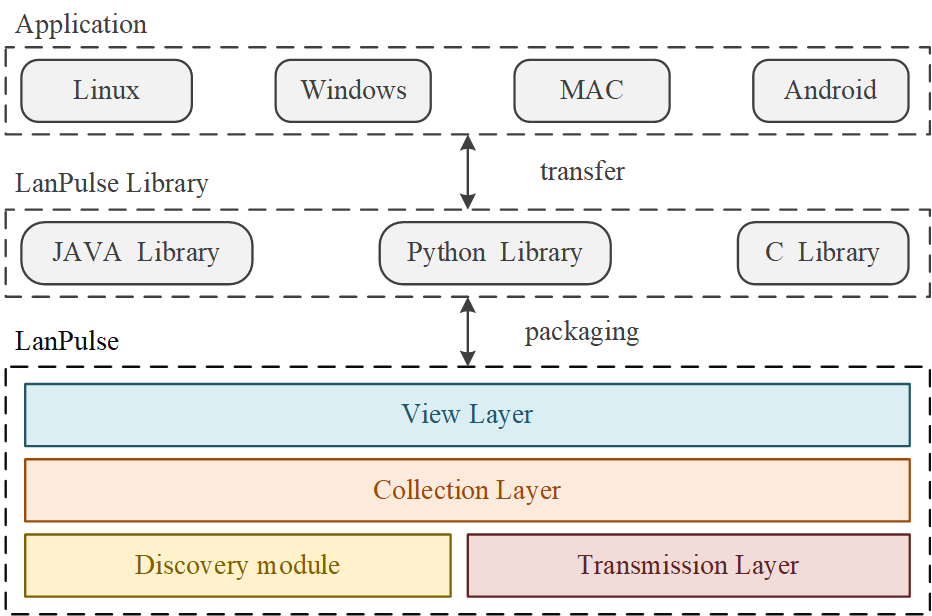

# LanPulse

---

It is used for multi-device and multi-platform interoperability and sharing within LAN.

# Structure

## 1. Control Layer (Networking construct)

### 1.1 Discovery module

including socket & keep-alive & discovery

reliable

#### 1.1.1 Master & Slave support

#### 1.1.2 Point-To-Point support

The difference between the master-slave mode is the heartbeat and network discovery modes.

#### 1.1.3 Online maintenance

State maintenance based on discovery patterns

#### 1.1.4 Discovery Relay

Realize device discovery and channel establishment across network segments

including other sub-net keep-alive & discovery

reliable

### 1.3 Graph model

weight nodirect graph structure

## 2. Transmission Layer

### 2.1 Data Sender

Send data as multicast

### 2.2 Data Reviced

Reviced data from multicast

### 2.3 Data Relay

Rely data when Relay mode

## 3. Collection Layer

### 3.1 Message register

Multi-platform release

Resolution and conversion of internal communication protocols

### 3.2 Extent support

## 4. View Layer

### 4.1 Sys API

Multi-platform release and API support

### 4.2 Extent support

